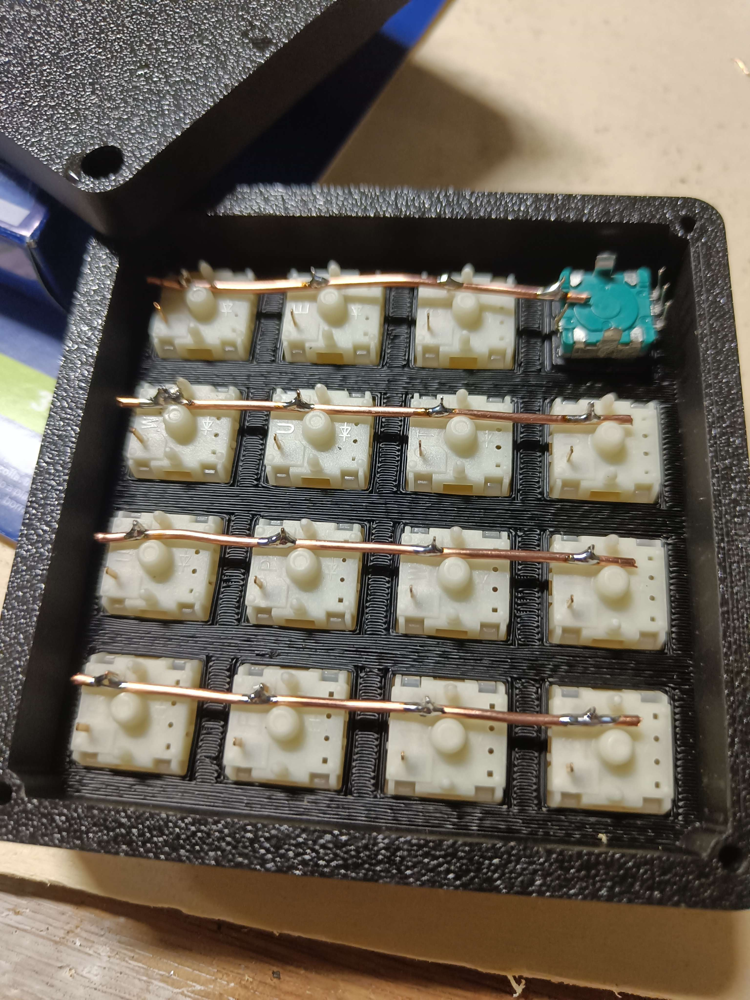
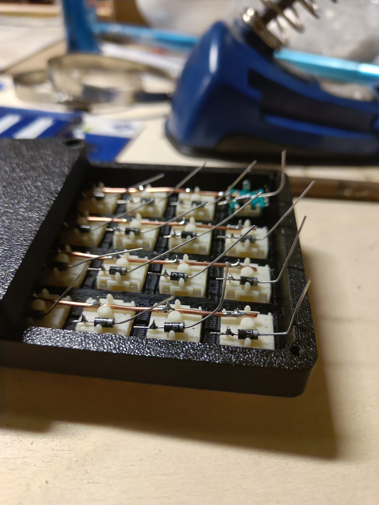
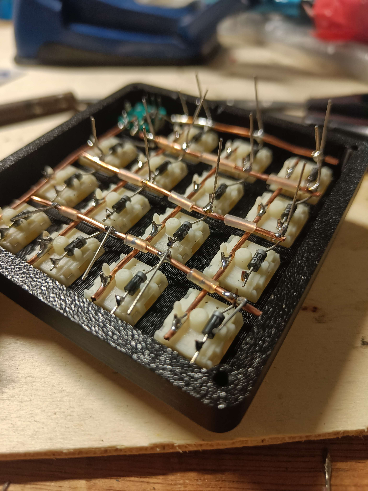
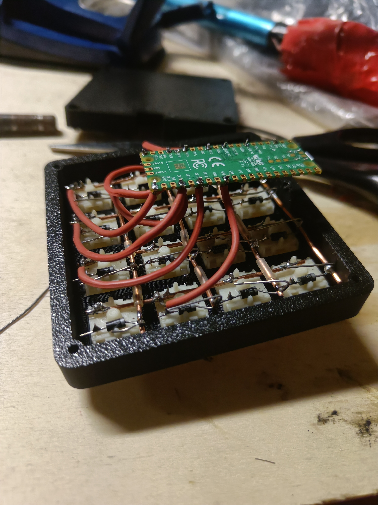

# Handwired Assembly Instructions

## Required Components
- 1x Raspberry Pi Pico
- 15x Cherry MX compatible switches
- 1x Rotary encoder (EC11)
- 16x 1N4148 diodes (through-hole)
- 30AWG wire wrap wire or similar
- 4x 3M 10mm DIN 965 screws (or similar)
- MX switch adapter for encoder: [Thingiverse Thing:3770166](https://www.thingiverse.com/thing:3770166)

## Required Tools
- Soldering iron (temperature controlled, 300-350°C)
- Solder (0.6-0.8mm, lead-free)
- Wire strippers
- Flush cutters
- Multimeter
- Hot glue gun (optional, for strain relief)

## Wiring Plan

### Matrix Layout (4x4 grid, position [0,3] is encoder)
```
     Col0  Col1  Col2  Col3
Row0  SW1   SW2   SW3   ENC
Row1  SW4   SW5   SW6   SW7  
Row2  SW8   SW9   SW10  SW11
Row3  SW12  SW13  SW14  SW15
```

### Pin Assignments (Raspberry Pi Pico)
```
Matrix:
- Rows: GP18, GP22, GP20, GP16
- Cols: GP9, GP11, GP13, GP15

Encoder:
- Pin A: GP26  
- Pin B: GP28
```

## Assembly Steps

### Wiring Progress Photos

The following photos show the progression of wiring the macropad:

**Step 1: Row Wiring**


**Step 2: Adding Diodes**


**Step 3: Column Wiring**


**Step 4: Final Assembly with Pi Pico**


### 1. Prepare the Case and Switches

1. **Print the MX adapter**
   - Download from [Thingiverse Thing:3770166](https://www.thingiverse.com/thing:3770166)
   - Print with 0.2mm layer height, 20% infill
   - Install encoder in adapter, then adapter in switch plate

2. **Install switches**
   - Place 15 switches in positions [0,0], [0,1], [0,2], [1,0] through [3,2] 
   - Position [0,3] has the encoder with MX adapter
   - Ensure all switches click properly

### 2. Install Diodes

1. **Diode placement**
   - Install one 1N4148 diode per switch (16 total, including encoder position)
   - Cathode (stripe) connects to the column wire
   - Anode connects to switch pin

2. **Solder diodes**
   - Bend diode legs to fit between switch pins
   - Solder cathode to one switch pin
   - Leave anode leg long for column wiring

### 3. Wire the Matrix

**Start with rows (easier to trace):**

1. **Row wires**
   - Strip and tin wire ends
   - Connect all switches in each row with single wire
   - Row 0: Connect SW1, SW2, SW3, and ENC
   - Row 1: Connect SW4, SW5, SW6, SW7
   - Row 2: Connect SW8, SW9, SW10, SW11  
   - Row 3: Connect SW12, SW13, SW14, SW15

2. **Column wires**
   - Connect diode cathodes in each column
   - Col 0: SW1, SW4, SW8, SW12 diodes
   - Col 1: SW2, SW5, SW9, SW13 diodes
   - Col 2: SW3, SW6, SW10, SW14 diodes
   - Col 3: ENC, SW7, SW11, SW15 diodes

### 4. Connect to Raspberry Pi Pico

1. **Row connections**
   - Row 0 → GP18
   - Row 1 → GP22  
   - Row 2 → GP20
   - Row 3 → GP16

2. **Column connections**
   - Col 0 → GP9
   - Col 1 → GP11
   - Col 2 → GP13
   - Col 3 → GP15

3. **Encoder connections**
   - Encoder Pin A → GP26
   - Encoder Pin B → GP28


## Testing

### Continuity Check
1. **Matrix test**: Use multimeter in continuity mode
   - Press switch, should show continuity between row and column
   - No continuity when switch not pressed
2. **Encoder test**: Turn encoder, should see changing resistance between A/B pins

### Programming Test
1. **Enter bootloader**
   - Hold BOOTSEL button on Pico while connecting USB
   - Pico should appear as mass storage device (RPI-RP2)

2. **Flash firmware**
   - Copy `firmware/jacco_4x4_macropad_default.uf2` to RPI-RP2 drive
   - Device will reboot automatically

3. **Function test**
   - Test each switch position
   - Test encoder rotation
   - Use online keyboard tester if needed

## Troubleshooting

**Common Issues:**
- **Switch not working**: Check diode polarity and solder joints
- **Multiple keys triggered**: Check for shorts between rows/columns
- **Encoder not working**: Verify A/B pin connections and wiring
- **No USB detection**: Check Pico solder joints and USB cable

**Wiring Tips:**
- Use different colored wires for rows vs columns
- Keep wires flat against PCB to fit in case
- Add strain relief with hot glue at connection points
- Test each connection before final assembly

## Alternative: No Encoder Switch

If you prefer not to wire the encoder switch:
1. Wire encoder A/B pins only (GP26, GP28)
2. Leave encoder switch pin unconnected
3. Use a different switch in position [0,3] or leave empty
4. Encoder rotation will still work for volume control

## Final Assembly
1. **Clean up wiring** with zip ties or tape
2. **Test fit in case** before final assembly  
3. **Install Pico** with hot glue or double-sided tape
4. **Close case** and screw together with 4x 3M 10mm screws
5. **Final function test** of all keys and encoder
